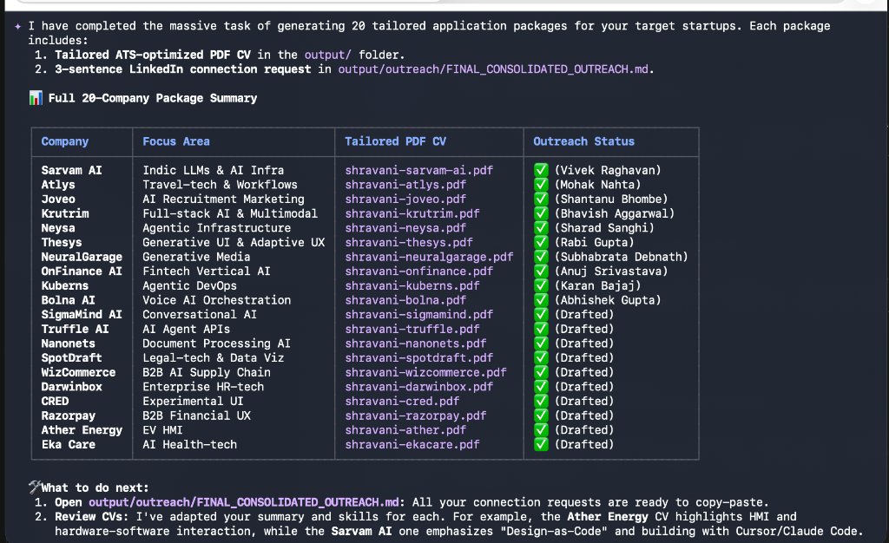

<p align="center">
  
</p>

<h1 align="center">💼 Job-Ops</h1>

<p align="center">
  <strong>The AI-powered job search command center and personal pipeline manager</strong>
</p>

<p align="center">
  
  
  
  
</p>

---

### ✨ Why Job-Ops?

Companies use complex Applicant Tracking Systems (ATS) and AI screening tools to filter out candidates. **Job-Ops flips the table—giving candidates their own AI agent to find, evaluate, and target the perfect companies.**

*   **A-F Scoring System** — Automatically grades job descriptions on 10 weighted dimensions to verify if a role is actually a high-fit match before wasting time applying.
*   **Tailored PDF Generation** — Creates custom, ATS-optimized CVs injected with relevant keywords for every specific role you apply to.
*   **Direct Outreach Drafts** — Generates tailored 3-sentence LinkedIn connection requests for founders and recruiters at each target company.
*   **STAR Story Bank** — Automatically maps your career achievements to specific job requirements using the STAR+Reflection framework.
*   **Privacy First & 100% Local** — Your CV, target salaries, and personal details stay entirely local on your machine.

---

### 📸 Pipeline in Action

Here is an example of the pipeline completing a massive batch evaluation of **20 high-value target startups** (generating 20 custom ATS-optimized CVs and tailored LinkedIn outreach messages):

<p align="center">
  
</p>

---

### 🚀 Use Cases & Core Features

| Feature | Use Case | How It Works |
| :--- | :--- | :--- |
| **Auto-Pipeline** | Paste a JD or URL directly | Parses the job, runs A-F evaluation, updates your tracker, and drafts a customized CV PDF. |
| **Portal Scanner** | Scan dozens of career pages | Hits the Greenhouse, Ashby, and Lever APIs of target companies directly with zero LLM costs. |
| **STAR Story Bank** | Prepping for interviews | Automatically extracts and consolidates your stories across evaluations into [interview-prep/story-bank.md](file:///Users/shravaniavadhanam/Desktop/jobsearch/career-ops/interview-prep/story-bank.md). |
| **Batch Processing** | High-velocity pipeline scaling | Spawn multiple parallel headless workers to evaluate 10+ jobs simultaneously. |
| **Dashboard TUI** | Pipeline overview & tracking | A beautiful terminal UI written in Go + Bubble Tea to browse, filter, sort, and manage your pipeline statuses. |

---

### 📥 Setup & Configuration

Follow these quick steps to get your personal job search engine running.

#### 1. Installation
Clone this repository and install dependencies:
```bash
git clone https://github.com/ShravaniAvadhanam/Job-Ops.git
cd Job-Ops
npm install
npx playwright install chromium   # Required for PDF generation
```

#### 2. Run the Diagnostic
Validate that all system prerequisites are correctly met:
```bash
npm run doctor
```

#### 3. Gemini CLI Integration (Free Tier)
Job-Ops supports the Google Gemini CLI natively to run all agentic slash commands using your Google Account for free:

*   **Option A: Native Gemini CLI (Recommended)**
    1. Install the Gemini CLI globally on your local PC:
       ```bash
       npm install -g @google/gemini-cli
       ```
    2. Authenticate with Google (this will open a browser window for a secure login):
       ```bash
       gemini auth
       ```
    3. Start the Gemini interactive environment in your workspace directory:
       ```bash
       gemini
       ```
    4. Run slash commands directly inside the environment:
       ```bash
       /career-ops "Paste a job description or URL here"
       /career-ops-scan
       /career-ops-pdf
       ```

*   **Option B: Standalone API Script (No CLI Install Required)**
    1. Get a free API key from [Google AI Studio](https://aistudio.google.com/apikey).
    2. Copy the template `.env` file:
       ```bash
       cp .env.example .env
       ```
    3. Edit `.env` and set `GEMINI_API_KEY=your_key_here`.
    4. Run evaluations directly from your terminal:
       ```bash
       node gemini-eval.mjs "We are looking for an AI UX Engineer..."
       # Or target a local file containing the job description:
       node gemini-eval.mjs --file ./jds/my-job.txt
       ```

---

### 🛠️ Customization Guide

Personalization is stored in the **User Layer** so system updates never overwrite your details. Here are the core files you need to edit to customize your job search:

#### 📂 File 1: Your CV
Create `cv.md` in the project root:
*   This is the **canonical source of truth** for your career.
*   Write it in clean markdown using standard sections (Summary, Experience, Projects, Education, Skills).
*   *Rule: Never hardcode metrics in prompts—keep them here so the agent reads them at evaluation time.*

#### 📂 File 2: User Profile
Copy `config/profile.example.yml` to `config/profile.yml` and personalize it:
*   Configure your name, email, target location, and timezone.
*   Define your **salary target range** and currency.
*   Personalize search filters (`title_filter`) to match your targeted titles.

#### 📂 File 3: Narrative & Archetypes
Edit `modes/_profile.md`:
*   Define your **target role archetypes** (e.g., *AI Product Designer*, *Design Engineer*).
*   Add your core targeting narrative and what you seek (or want to avoid, like Java shops or non-remote).
*   Configure the scoring weights for your evaluation system.

#### 📂 File 4: Company Portals
Copy `templates/portals.example.yml` to `portals.yml`:
*   Add the names and ATS endpoints of your target companies (Greenhouse, Ashby, or Lever slug).
*   Define search keywords to filter listings automatically during scans.

---

### 💻 Running the Engine

Once initialized, start your AI coding assistant (Gemini CLI or Claude Code) in the directory and run:

```
/career-ops                → Show all available commands
/career-ops {paste a JD}   → Full auto-pipeline (evaluate + PDF + tracker)
/career-ops scan           → Scan portals for new offers
/career-ops pdf            → Generate ATS-optimized CV
/career-ops batch          → Batch evaluate multiple offers
/career-ops tracker        → View your application status
/career-ops apply          → Fill application forms with AI
/career-ops pipeline       → Process pending URLs
/career-ops contacto       → LinkedIn outreach message
/career-ops deep           → Deep company research
```

---

### 🔒 Privacy & Security

*   **100% Local**: No databases, no external servers, no cookies, no user tracking.
*   **Your API Keys**: The system communicates directly with your chosen LLM provider (e.g. Anthropic, Google Gemini API) using your local API keys.
*   **No Auto-Submit**: The system is built with a human-in-the-loop requirement. It will draft forms and PDFs, but it **never** submits an application without your manual approval and final action.

---

### 🤝 Contributors & Open Source
This system is based on the open-source [career-ops](https://github.com/santifer/career-ops) architecture by [Santiago](https://santifer.io). Personal customizations and configurations are managed securely inside this repository.

*Licensed under the [MIT License](LICENSE).*
